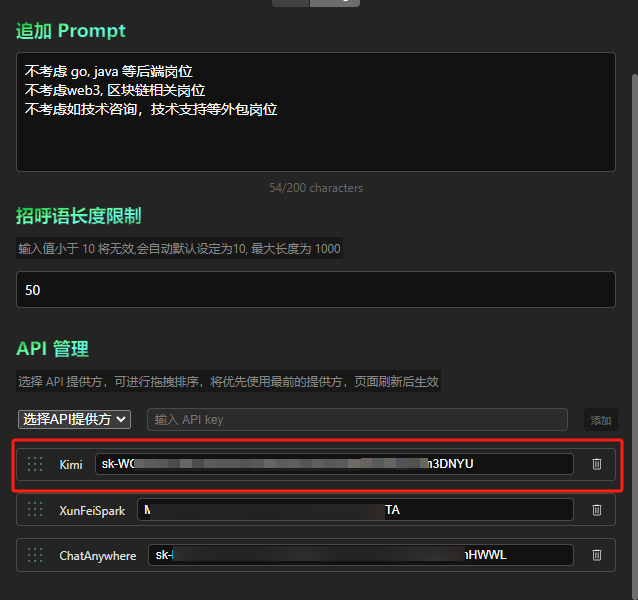

<p align='center'><h1 align='center'>Findjob-bot</h1></p>

利用 AI 帮助你找工作

## 写在前面

作者本人已经失业很久了，本项目的初衷是为了帮助我进行岗位筛选，降低有效沟通成本。 写在半途中，觉得可能很多人和我一样，面对当下就业环境艰难而倍感疲惫， 所以就做一些通用性的适配。

**本项目作为开源项目，我不希望本项目以任何方式，任何目的进行盈利。**

 大家都已经很难了，就请多一份温暖吧。


## Feature

### Boss 直聘

- 根据简历 + 岗位 JD 自定生成求职招呼语， 并自动投递
- 自动跳过历史沟通项 
- 支持循环操作上限
- 抓取公司信息
- 自动跳过公司信息为空的公司
- 多 AI 接口接入，多模型支持，自动调度
- 自动过滤和意向城市不匹配的岗位信息


### 注意点

你需要设定至少一个偏好， 否则该插件将无法预期运行。


## 目前支持的 API 提供方

| 提供方       | 相关api 获取文档                                             |
| ------------ | ------------------------------------------------------------ |
| xunfei 星火  | https://xinghuo.xfyun.cn/sparkapi?scr=price                  |
| chatanywhere | https://github.com/chatanywhere/GPT_API_free<br />https://chatanywhere.apifox.cn/ |
| kimi         | https://platform.moonshot.cn/docs/intro#%E8%8E%B7%E5%8F%96-api-%E5%AF%86%E9%92%A5 |


## 欢迎优化PR

### 如何新增一个 AI 接口教程

首先你需要在这里添加一个 Option 选项：


你需要在 `typings/aiModelAdaptor.ts` 中新增一项, 例如：

```ts
export enum AgentsType {
    "XunFeiSpark" = "XunFeiSpark",
    "ChatAnywhere" = "ChatAnywhere",
    "Kimi" = "Kimi"
}
```


接着你需要新建一个文件 `aiModels/kimi.ts` ，该文件中应该实现一个集成自 `AiApiBasic`  对应的类:

```ts

export class xunfeiSparkAPIAIService extends AiApiBasic {
    constructor(modelList: string[]) {
        const apiUrl = 'https://api.moonshot.cn/v1/chat/completions'
        super(AgentsType.Kimi, apiUrl, modelList, kimiAPI)
    }
}
```

其中，`kimiAPI` 是对应的请求函数，下面是一个示例：

```ts
import { AgentsType } from "@/typings/aiModelAdaptor";
import { AiApiBasic } from ".";
import { RequestFn } from "@/typings/app";


const kimiAPI: RequestFn = function ({ apikey, apiUrl, model, userMessage }) {
    return new Promise((resolve, reject) => {
        const options = {
            method: 'POST',
            headers: {
                'Authorization': `Bearer ${apikey}`, // 替换成你的 API key
                'Content-Type': 'application/json',
                'accept': 'application/json',
            },
            body: JSON.stringify({
                model: model,
                messages: [
                    {
                        role: "system",
                        content: "Please analyze the user's provided resume information and job description to assess how well the user matches the job. Consider key job-related factors such as job title, required skill set, education, years of experience, age, and any other relevant details. Based on the analysis, write a polite and conversational job application greeting, aiming to secure an interview or job opportunity. Be sure to use professional yet friendly language."
                    },
                    {
                        role: "user",
                        content: userMessage
                    }
                ],
                temperature: 0.3
            })
        };

        fetch(apiUrl, options)
            .then(response => response.json())  // 处理 JSON 响应
            .then(result => {
                if (result.choices && result.choices[0].message) {
                    resolve(result.choices[0].message.content);  // 返回结果
                } else {
                    reject("接口获取信息错误，请排查：moonshot api");
                }
            })
            .catch(error => reject(error));  // 捕获错误
    });
}


export class kimiAPIAIService extends AiApiBasic {
    constructor(modelList: string[]) {
        const apiUrl = 'https://api.moonshot.cn/v1/chat/completions'
        super(AgentsType.Kimi, apiUrl, modelList, kimiAPI)
    }
}
```

最后，你需要在 `entrypoints/background.ts` 文件中 导入该类， 并传入该 api 执行的 model 列表以实例化：

```diff
function initAiApiAdaptor() {
  AI = new AiApiAdaptor([
    new chatanywhereAIService(['gpt-4o-mini', 'gpt-3.5-turbo', 'gpt-4o', 'gpt-4']),
    new xunfeiSparkAPIAIService(['generalv3']),
+    new kimiAPIAIService(["moonshot-v1-8k"])
  ])
}
```

然后输入 apikey, 就可以测试了：



以 Chrome 为例你可以在 chrome://extensions/ 


查看到控制台，在这里可以看到日志，以及网络请求信息。


## 请我吃馒头

